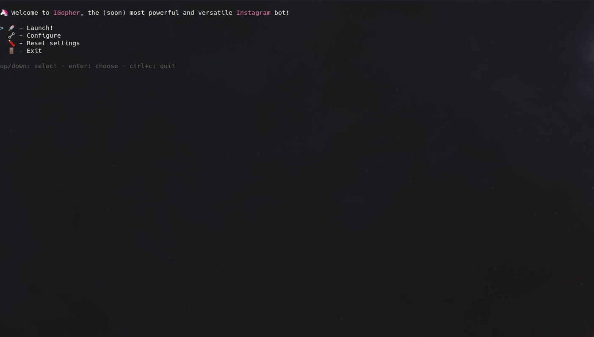

<h1 align="center">IGopher : (WIP) Golang smart bot for Instagram DM automation</h1>
<p align="center">
    
</p>
<p align="center">
  <a href="https://github.com/hbollon/IGopher/actions" target="_blank">
    
  </a>
  <a href="https://goreportcard.com/report/github.com/hbollon/igopher" target="_blank">
    
  </a>
  <a href="https://github.com/hbollon/igopher/blob/master/LICENSE.md" target="_blank">
    
  </a>
  <a href="https://godoc.org/github.com/hbollon/igopher" target="_blank">
    
  </a>
  <a href="https://pkg.go.dev/github.com/hbollon/go-instadm" target="_blank">
    
  </a>
</p>

<p align="center">⚡ Powerful, customizable and easy to use Instagram dm bot. With TUI and GUI! Using Selenium webdriver and Yaml configuration files.</p>

---

> Disclaimer: This is a research project. I am in no way responsible for the use you made of this tool. In addition, I am not responsible for any sanctions and/or limitations imposed on your account after using this bot.

---

## Table of Contents

- [Introduction](#introduction)
- [Features](#features)
- [Getting Started](#getting-started)
- [Contributing](#-contributing)
- [Author](#author)
- [License](#-license)

## Introduction

IGopher is a new Instagram automation tool that aims to simplify the deployment of such tools and make their use more pleasant thanks to a TUI (terminal User Interface) as well as a GUI (Graphical User Interface) arriving very soon.

<p align="center">
  
  <small>Automatic user fetching and message sending!</small>
</p>

The bot configuration is very easy thanks to the different configuration menus in the TUI. Parameters are managed and saved in Yaml files easy to edit manually!

<p align="center">
  
  <small>Easily configurable and easy to use thanks to his TUI !</small>
</p>

### Requirements
- [Java](https://java.com/fr/download/)
- For Windows:
  - [Optionnal] [Windows Terminal](https://www.microsoft.com/fr-fr/p/windows-terminal/9n0dx20hk701?activetab=pivot:overviewtab) -> in order to have a best TUI experience

## Features
- Selenium webdriver engine :stars:
- Automatic dependencies downloading and installation :stars:
- Automated IG connection & message sending :stars:
- Users scrapping from ig user followers :stars:
- Scheduler :stars:
- Quotas & user blacklist modules :stars:
- Human writing simulation :stars:
- Fully and easily customizable through Yaml files or with TUI :stars:
- TUI (Terminal User Interface) :stars:
- Many more to come ! 🥳

**Check this [Project](https://github.com/hbollon/igopher/projects/1) to see all planned features for this tool! Feel free to suggest additional features to implement! 🥳**

## Getting Started

### From release

1. Download and install [Java](https://java.com/fr/download/) (needed for Selenium webdriver) and add it to your path (on Windows)
2. Download [lastest release](https://github.com/hbollon/igopher/releases/latest) executable for your operating system
3. Move the executable to a dedicated folder (it will create folders/files)
4. Launch it:
- On Windows, open a **Windows Terminal** in the folder (or powershell/cmd but the experience quality can be lower) and execute it: ```./tui.exe``` or just drag and drop tui.exe in your command prompt
- On Linux, open you favorite shell in the folder and execute it: ```./tui```
5. Configure the bot with your Instagram credentials and set your desired scrapping and autodm settings. To do that, you can use the TUI settings screen or directly edit the config.yaml file.
6. You're ready! Just hit the "Launch" option in the TUI main menu 🚀

### From sources

1. Download and install [Java](https://java.com/fr/download/) (needed for Selenium webdriver) and add it to your path (on Windows)
2. Install [Go](https://golang.org/doc/install) (v1.13+) on your system
3. Download [lastest release](https://github.com/hbollon/igopher/releases/latest) source archive or clone the master branch
4. Launch it with this command: ```go run ./cmd/igopher/tui```
5. Configure the bot with your Instagram credentials and set your desired scrapping and autodm settings. To do that, you can use the TUI settings screen or directly edit the config.yaml file.
6. You're ready! Just hit the "Launch" option in the TUI main menu 🚀

### Flags

IGopher have a flags system for debuging or to enable system feature.
You can activate them by adding them after the executable call, for exemple to activate headless mode:
```./tui --headless```

There is the list of all available flags:
```
--debug
      Display debug and selenium output
--force-download
      Force redownload of all dependencies even if exists
--headless
      Run WebDriver with frame buffer
--ignore-dependencies
      Skip dependencies management
--loglevel string
      Log level threshold (default "info")
--port int
      Specify custom communication port (default 8080)
```

You can recover this list by adding **--help** flag.

## 🤝 Contributing

Contributions are greatly appreciated!

1. Fork the project
2. Create your feature branch (```git checkout -b feature/AmazingFeature```)
3. Commit your changes (```git commit -m 'Add some amazing stuff'```)
4. Push to the branch (```git push origin feature/AmazingFeature```)
5. Create a new Pull Request

Issues and feature requests are welcome!
Feel free to check [issues page](https://github.com/hbollon/igopher/issues).

## Author

👤 **Hugo Bollon**

* Github: [@hbollon](https://github.com/hbollon)
* LinkedIn: [@Hugo Bollon](https://www.linkedin.com/in/hugobollon/)
* Portfolio: [hugobollon.me](https://www.hugobollon.me)

## Show your support

Give a ⭐️ if this project helped you!

## 📝 License

This project is under [MIT](https://github.com/hbollon/igopher/blob/master/LICENSE.md) license.
