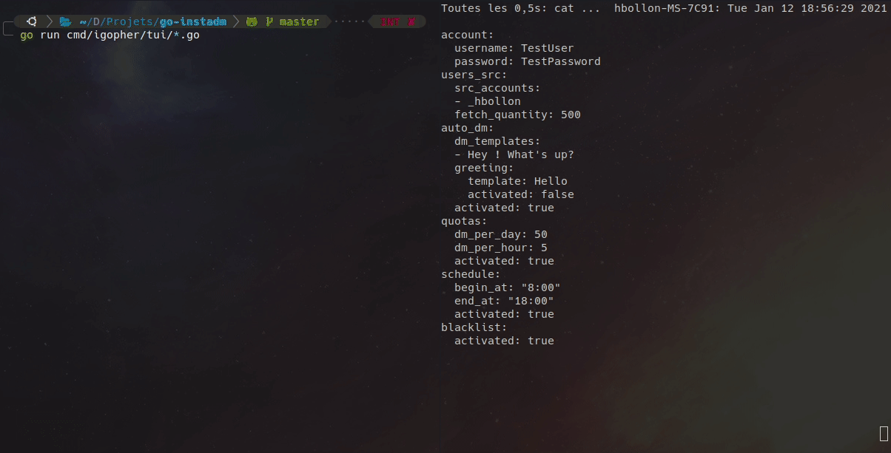

<h1 align="center">IGopher : (WIP) Golang smart bot for Instagram DM automation</h1>
<p align="center">
    
</p>
<p align="center">
  <a href="https://github.com/hbollon/IGopher/actions" target="_blank">
    
  </a>
  <a href="https://goreportcard.com/report/github.com/hbollon/igopher" target="_blank">
    
  </a>
  <a href="https://github.com/hbollon/igopher/blob/master/LICENSE.md" target="_blank">
    
  </a>
  <a href="https://godoc.org/github.com/hbollon/igopher" target="_blank">
    
  </a>
  <a href="https://pkg.go.dev/github.com/hbollon/go-instadm" target="_blank">
    
  </a>
</p>

<p align="center">⚡ Powerful, customizable and easy to use Instagram dm bot. With TUI and GUI! Using Selenium webdriver and Yaml configuration files.</p>

---

> Disclaimer: This is a research project. I am in no way responsible for the use you made of this tool. In addition, I am not responsible for any sanctions and/or limitations imposed on your account after using this bot.

---

<p align="center">
  
  <small>Easily configurable and easy to use thanks to his TUI !</small>
</p>

## Table of Contents

- [Requirements](#requirements)
- [Features](#features)
- [Installation](#installation)
- [Author](#author)
- [Contributing](#-contributing)
- [License](#-license)

## Requirements
- [Go](https://golang.org/doc/install) (v1.13+)

## Features
- Selenium webdriver engine :stars:
- Automatic dependencies downloading and installation :stars:
- Automated IG connection & message sending :stars:
- Scheduler :stars:
- Quotas & user blacklist modules :stars:
- Human writing simulation :stars:
- Fully and easily customizable through Yaml files or with TUI :stars:
- TUI (Terminal User Interface) :stars:
- Many more to come ! 🥳

**Check this [Project](https://github.com/hbollon/igopher/projects/1) to see all planned features for this tool! Feel free to suggest additional features to implement! 🥳**

## Installation
**1. Clone this repo**

**2. Run it:**

```go
go run cmd/igopher/tui/*.go
```

## Author

👤 **Hugo Bollon**

* Github: [@hbollon](https://github.com/hbollon)
* LinkedIn: [@Hugo Bollon](https://www.linkedin.com/in/hugobollon/)
* Portfolio: [hugobollon.me](https://www.hugobollon.me)

## 🤝 Contributing

Contributions, issues and feature requests are welcome!<br />Feel free to check [issues page](https://github.com/hbollon/igopher/issues). 

## Show your support

Give a ⭐️ if this project helped you!

## 📝 License

This project is under [MIT](https://github.com/hbollon/igopher/blob/master/LICENSE.md) license.
